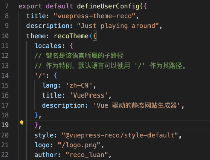

## 仓库分支说明

### gh-page分支
vuepress-reco2生成的可部署的html代码，用于提供给blog page。

### master分支
vuepress-reco2的工程文件，包括文档目录`doc`和其他文章目录`blog`。如果在新环境中，请按照以下具体步骤进行部署。


---

## 新环境配置指南

### 1. 安装node.js
```shell

sudo apt-get update
sudo apt-get install -y ca-certificates curl gnupg
sudo mkdir -p /etc/apt/keyrings
curl -fsSL https://deb.nodesource.com/gpgkey/nodesource-repo.gpg.key | sudo gpg --dearmor -o /etc/apt/keyrings/nodesource.gpg

NODE_MAJOR=21
ARCH=amd64
echo "deb [arch=$ARCH signed-by=/etc/apt/keyrings/nodesource.gpg] https://deb.nodesource.com/node_$NODE_MAJOR.x nodistro main" | sudo tee /etc/apt/sources.list.d/nodesource.list

sudo apt-get update
sudo apt-get install nodejs -y
```


### 2. 安装vuepress-reco2
#### 2.1 初始化，并选择 2.x
```shell
npm install @vuepress-reco/theme-cli@1.0.7 -g
theme-cli init
```

#### 2.2 白屏问题解决
由于生成页面会出现白屏无反应的问题，需要在config中设置locales配置项。在主题配置里添加以下内容即可。

```TypeScript
locales: {
      // 键名是该语言所属的子路径
      // 作为特例，默认语言可以使用 '/' 作为其路径。
      '/': {
        lang: 'zh-CN',
        title: 'VuePress',
        description: 'Vue 驱动的静态网站生成器',
      },
    },
```
#### 2.3 运行
- **本地运行**
```shell
npm run dev
```
- **本地编译**
```shell
npm run build
```
参考
> [vuepress-reco2主页](https://vuepress-theme-reco.recoluan.com/)
> [白屏问题解决方案]([https://vuepress-theme-reco.recoluan.com/](https://github.com/vuepress-reco/vuepress-theme-reco/issues/257)https://github.com/vuepress-reco/vuepress-theme-reco/issues/257)
