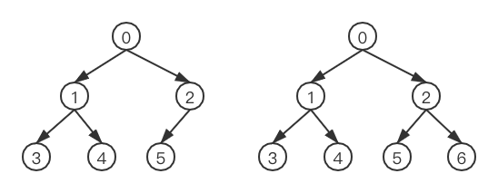

# 树

* [返上层目录](../data-structures.md)

# 二叉树的类型

## 完全二叉树

### 完全二叉树的最后一个非终端节点的下标

堆排序是基于完全二叉树实现的，在将一个数组调整成一个堆的时候，关键之一的是确定最后一个非叶子节点的序号，这个序号为`n/2-1`，n为数组的长度。但是为什么呢？

完全二叉树的性质之一是：

> 如果节点序号为i，在它的左孩子序号为2\*i+1，右孩子序号为2\*i+2。

<!-- docs/machine-learning/coding/cs-courses/data-structures-and-algorithms/data-structures/tree/pic/complete-binary-tree-1.png -->
可以分两种情形考虑：

* 堆的最后一个非叶子节点若只有左孩子

  树的节点数为偶数，如上图为6，则有
  $
  \begin{aligned}
  &2*i+1=n-1\\
  \Rightarrow&i=(n-2)/2=n/2-1
  \end{aligned}
  $

* 堆的最后一个非叶子节点有左右两个孩子

  树的节点数为奇数，如上图为7
  $
  \begin{aligned}
  &2*i+2=n-1\\
  \Rightarrow&i=(n-3)/2=(n-1)/2-1=[n/2]-1
  \end{aligned}
  $

所以，无论最后一个节点的父节点有没有右孩子，其父节点的序号都是$[n/2]-1$。

注意：这里的序号都是从0开始的，不是从1开始。

# 平衡二叉树（AVL）

[平衡二叉树（AVL）图解与实现](https://blog.csdn.net/u014634338/article/details/42465089)

# 伸展树

[伸展树(Splay tree)图解与实现](https://blog.csdn.net/u014634338/article/details/49586689)

# 红黑树

[我画了 20 张图，给女朋友讲清楚红黑树](https://zhuanlan.zhihu.com/p/95892351)

[红黑树揭秘](https://zhuanlan.zhihu.com/p/122257022)

# 参考资料

* [堆排序（完全二叉树）最后一个非叶子节点的序号是n/2-1的原因](https://www.cnblogs.com/malw/p/10542557.html)

“完全二叉树的最后一个非终端节点的下标”参考此博客。

